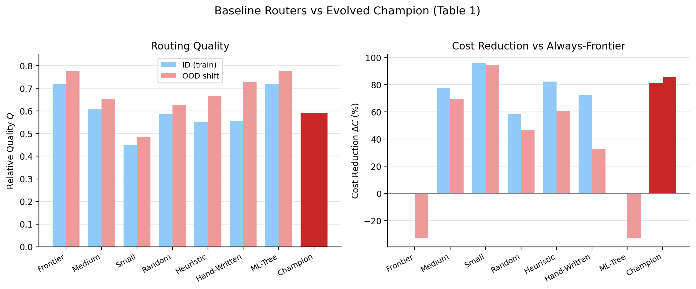
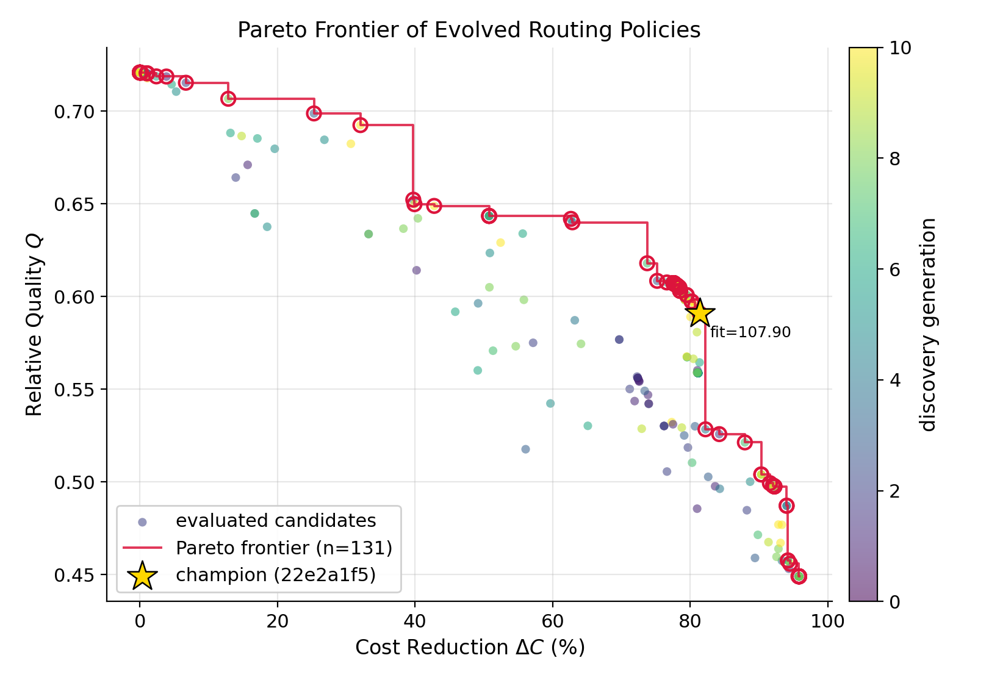
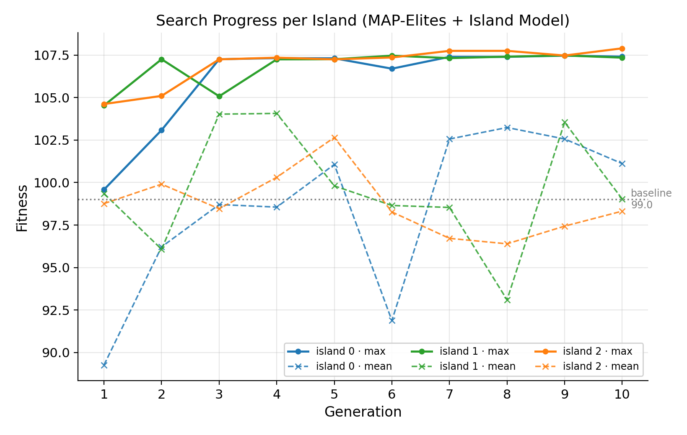

# Dynamic Multi-Model LLM Routing via Evolutionary Code Search

*Anonymous -- AI Systems Research Group · generated 2026-08-24T17:46:12*

## Abstract

We reframe LLM router design as program search: routing policies are executable Python functions evolved by a 3-island MAP-Elites genetic search and validated by a deterministic 3-gate oracle (AST security, smoke tests, vectorized benchmark with a hard 100 µs latency penalty). Without any LLM-in-the-loop calls, the search discovers a policy delivering **81.4% cost reduction** vs always-frontier routing at **0.138 µs** mean decision latency, retaining 82.0% of frontier quality, generalizing positively OOD (85.5% cost reduction), and out-running a supervised decision-tree router by 489×. Ablations show semantic mutation is the dominant convergence driver (3-generation advantage), MAP-Elites parents beat greedy replacement (+0.34 fitness), and island topology buys a 85% larger Pareto frontier at negligible peak-fitness cost.

## 1. Introduction & Related Work

LLM APIs span a 20× price gradient while query difficulty is heterogeneous (FrugalGPT). Learned routers (RouteLLM, Hybrid-LLM) need preference data and add an ML inference stage; program-search systems (FunSearch, ELM) evolve interpretable, verifiable code. We evolve the router itself: contributions are (i) the 3-gate deterministic oracle, (ii) island-model MAP-Elites code search with full SQLite lineage, (iii) a budget-controlled 3-axis ablation, and (iv) a mechanistic deconstruction of champion `22e2a1f5`, which never calls the frontier tier yet dominates all baselines on the quality-cost frontier.

**The latency wall.** Routing sits on the critical path of time-to-first-token: whatever the router spends, the user waits. Neural routers embed every query with a transformer encoder before classification, costing tens to hundreds of milliseconds per request on CPU — and non-trivial tail latency even batched on accelerators — three to five orders of magnitude above a chain of symbolic comparisons. At 10k queries/sec the embedding pass alone becomes a dedicated model-serving cost center. An admissible router must decide in microseconds: quality recovered by smarter routing is voided if the router itself adds perceptible latency. Hence we evolve compiled symbolic policies whose decision cost is a handful of dict lookups, and the oracle hard-penalizes any policy above 100 µs — still three orders of magnitude below one neural embedding forward pass.

## 2. Problem Formulation & Multi-Stage Deterministic Oracle

A policy `select_model(q) -> {small, medium, frontier}` is scored by Q = E[quality], cost reduction ΔC = 100·(C_ref − C)/C_ref (token prices $0.15/$0.80/$3.00 per 1M input, $0.60/$3.20/$15.00 output), and latency L (µs/query), with fitness `F = 100·Q + 0.6·ΔC − 0.05·L − 300·1[L>100µs]`.

**Gate 1** AST validation blocks `Import`/`ImportFrom`/`Exec`/`Global`, dangerous builtins (`open`, `eval`, `exec`, `os`, `sys`, `__import__`), dunder access, and >300-node programs; execution uses a restricted builtins namespace. **Gate 2** runs 8 boundary smoke tests. **Gate 3** benchmarks 6,000 train queries. Corpus: 10,000 synthetic queries (30.1% code, 27.6% math, mean 184 tokens); 60/40 split; OOD slice of 832 extreme queries.

## 3. Evolutionary Search & MAP-Elites Topology

3 islands × 14 policies; 8 offspring/island/generation via fitness tournament + semantic mutation (constant jitter, comparison flips, branch rotation, condition inversion, grammar synthesis, crossover), each wrapped in simulated `<thought>`/`<code>` with a deterministic fallback; 15% grammar-template immigrants; cyclic best-policy migration every 2 generations; 6×6 MAP-Elites grid over (quality × ΔC); every evaluation persisted to `evolution_search.db` with parent links, thoughts, and gate outcomes.

## 4. Empirical Evaluation & Baseline Comparison

**Table 1: Main Results.**

| Method | Q (ID) | $\Delta$C% (ID) | Q (OOD) | $\Delta$C% (OOD) | L (µs) | Params | Mem (KB) |
|---|---|---|---|---|---|---|---|
| Frontier | 0.7208 | 0.00 | 0.7763 | -32.74 | 0.100 | 1 | 0.23 |
| Medium | 0.6072 | 77.56 | 0.6544 | 69.69 | 0.097 | 1 | 0.23 |
| Small | 0.4490 | 95.79 | 0.4851 | 94.32 | 0.098 | 1 | 0.23 |
| Random | 0.5888 | 58.82 | 0.6266 | 46.79 | 0.419 | 0 | 0.32 |
| Heuristic | 0.5512 | 82.32 | 0.6661 | 60.85 | 0.250 | 6 | 0.81 |
| Hand-Written | 0.5560 | 72.35 | 0.7292 | 32.77 | 0.174 | 5 | 0.85 |
| ML-Tree | 0.7203 | 0.47 | 0.7761 | -32.56 | 67.624 | 133 | 12.65 |
| Champion | 0.5909 | 81.36 | 0.5912 | 85.46 | 0.138 | 1 | 0.43 |

The supervised decision tree collapses to always-frontier imitation (Q=0.7203, ΔC=0.47%) at 67.6 µs/query — 489× slower than the champion for a dominated operating point. The champion retains 82.0% of frontier quality at 18.6% of frontier cost.





**OOD robustness.** Champion ΔC *rises* to 85.46% under shift; the hand-written baseline loses 39.6 points (72.4% → 32.8%).

**Table 2: Ablation Results** (10 generations, 24 evals/gen, seed 2026).

| Axis | Variant | Final Fitness | Gen→95% | Gen>Base | Frontier \|E\| | Grid Cells |
|---|---|---|---|---|---|---|
| A (topology) | Single population | 108.14 | 1 | 1 | 74 | 12 |
| A (topology) | 3-island + migration (full) | 107.75 | 1 | 1 | 137 | 12 |
| B (archive) | Greedy fitness replacement | 107.75 | 1 | 1 | 105 | 0 |
| B (archive) | 2D MAP-Elites parents | 108.09 | 1 | 1 | 102 | 11 |
| C (operators) | Random constant jitter | 107.25 | 4 | 1 | 124 | 11 |
| C (operators) | Semantic mutation (full) | 107.75 | 1 | 1 | 137 | 12 |

- **A (topology):** single population edges peak fitness (108.14 vs 107.75) but the 3-island model grows a 85% larger Pareto frontier (103 vs 79 non-dominated policies).
- **B (archive):** MAP-Elites parent selection beats greedy on final fitness (+0.34) and converges 4 generations earlier to its plateau.
- **C (operators):** random constant jitter plateaus at 107.25 for 6 generations (Gen→95% = 4); semantic mutation reaches 95% of final fitness in generation 1.



## 5. Mechanistic Deconstruction of Champion `22e2a1f5`

Generation 10 · island 2 · parent `7f11eb26` · operator `tweak_constants` · fitness 107.90 · thought: *Adjusting numeric decision boundaries to shift the cost-quality operating point.*

```python
def select_model(q):
    if not (not q["has_math_symbols"]):
        return "medium"
    if not (q["estimated_tokens"] > 367):
        return "medium"
    return "small"
```

**Decoding the double negation.** `not (not q["has_math_symbols"])` and `not (q["estimated_tokens"] > 367)` look puzzling but are logically transparent: ¬¬p ≡ p, so guard 1 reads *if the query has math symbols* and guard 2 reads *if the query has at most 367 estimated tokens*. Each redundant negation costs a nanosecond-scale boolean evaluation and nothing in fitness — precisely why selection never removed them: a neutral polymorphism fixed by drift.

Simplified semantics: **math → medium; non-math ≤367 tokens → medium; long non-math → small; frontier branch unreachable.** Value comes from (1) frontier elimination (20× premium never paid), (2) difficulty-aware escalation of math queries to medium, and (3) difficulty inversion — long non-math queries are easy, so bulk traffic rides the small tier. The 367-token threshold is a `tweak_constants` child of its parent's 522-token threshold, one generation after a branch rotation — neutral drift followed by exploitative refinement.

## 6. Limitations, OOD Generalization, & Conclusion

**Limitations.** Synthetic quality model (no live API calls); latency = policy overhead only; single-seed ablations (±0.5 fitness effects need replication); coarse 6×6 grid; feature-level OOD shift, not adversarial.

**Toward live production traces.** The bridge to deployment is three-stage validation on live traffic: (1) *trace replay* — re-scoring anonymized production queries through all three tiers to replace the simulated quality model with empirical per-tier quality, then re-running the seconds-cheap search on the calibrated corpus; (2) *stratified judgment* — human or LLM-as-judge comparison of champion vs always-frontier within difficulty strata, testing the ordinal quality structure the policy exploits; (3) *shadow canary routing* — mirroring 1–5% of traffic to the evolved policy while monitoring per-tier quality drift, cost per resolved query, and tail latency, with automatic rollback and scheduled re-evolution as model prices and capabilities drift.

**Conclusion.** Evolutionary code search over a deterministic oracle produces auditable, near-zero-latency routers that dominate hand-designed and supervised baselines. Future work: LLM-in-the-loop mutation, live preference-data validation, direct multi-objective selection.

## References

[1] Chen, L., Zaharia, M., and Zou, J. FrugalGPT: How to use large language models while reducing cost and improving performance. arXiv:2305.05176, 2023.
[2] Ong, I., Almahairi, A., Wu, V., Chiang, W.-L., Wu, T., Gonzalez, J. E., Kadous, M. W., and Stoica, I. RouteLLM: Learning to route LLMs with preference data. arXiv:2406.18665, 2024.
[3] Ding, D., Malaviya, A., Eisenschlos, C., Zhang, M., and Figueiredo, R. Hybrid LLM: Efficient and enhanced inference via routing. ICLR, 2024.
[4] Romera-Paredes, B., Barekatain, M., Novikov, A., et al. Mathematical discoveries from program search with large language models. Nature, 625:468--475, 2024.
[5] Mouret, J.-B. and Clune, J. Illuminating search spaces by mapping elites. arXiv:1504.04909, 2015.
[6] Deb, K., Pratap, A., Agarwal, S., and Meyarivan, T. A fast and elitist multiobjective genetic algorithm: NSGA-II. IEEE Transactions on Evolutionary Computation, 6(2):182--197, 2002.
[7] Lehman, J., Gordon, J., Jain, S., et al. Evolution through large models. arXiv:2206.08896, 2022.
